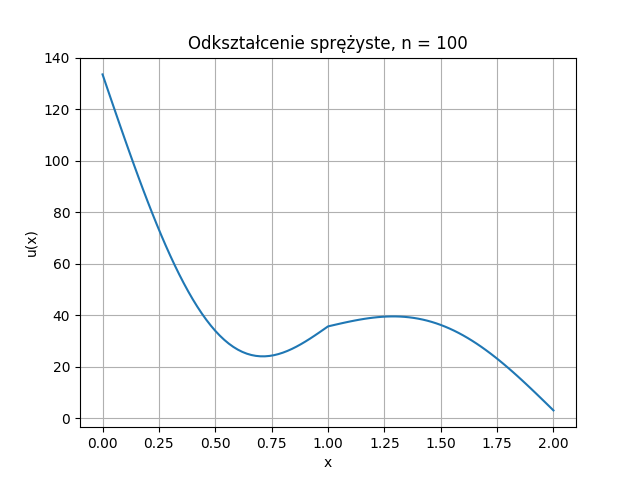

# MES-Project

## Równania różniczkowe i różnicowe 2025

### AGH, Wydział Informatyki, Informatyka

### Zadanie

Pełna treść realizowanego zadania dostępna jest [tutaj](tresc_zadania.pdf).

Zadanie polegało na rozwiązaniu poniższego równania Metodą Elementów Skończonych

$$ - \frac{d}{dx} \left( E(x) \frac{du(x)}{dx} \right) = -1000 \sin(\pi x) $$

$$ u(2) = 3 $$

$$ \frac{du(0)}{dx} + 2 u(0) = 10 $$

$$
E(x) =
\begin{cases} 
2 & \text{dla } x \in [0,1], \\
6 & \text{dla } x \in (1,2].
\end{cases}
$$

gdzie \( u \) to poszukiwana funkcja

$$ [0,2] \ni x \longmapsto u(x) \in \mathbb{R} $$

### Wykorzystane biblioteki

- numpy - do całkowania kwadraturą Gaussa
- matplotlib - do wizualizacji
  
### Wizualizacja
Wykres szukanej funkcji $u(x)$ dla podzieleniu przedziału na 100 odcinków:

|  |
|:--:|
